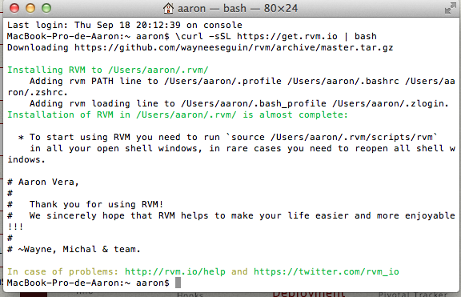
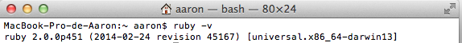
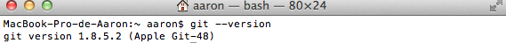
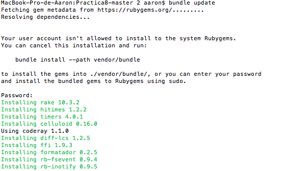
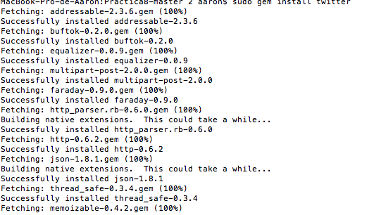

##Tutorial Rvm,Ruby y Git

Lo primero que debemos instalar Rvm (Ruby Version Manager) nos permite instalar y gestionar varios intérpretes ruby y conjuntos de gemas (gemsets).

## Instalación RVM(Ruby Version Manager)

Para instalar deberemos ejecutar los siguientes comandos_:
$ \curl -L https://get.rvm.io | bash -s stable

 En caso de tener instalado para actualizar la version de rvm:
 

También podemos saber la versión de ruby instalada y que se esta utilizando de la siguiente manera:

ruby -v

##Instalación Git

Git es una sistema de control de versiones.

Ya lo tengo instalado,para instalarlo se hace de la siguiente manera:

apt-get install git

##Instalación de Gemas
 
La manera de instalar una gema es la siguiente:

gem install [gem]

Gema sinatra:Es un DSL para crear aplicaciones web rápido y con esfuerzo mínimo. Se trata de una biblioteca de aplicaciones web open source escrita en Ruby.

La podremos instalar con el comando:gem install sinatra

##Instalación Gema Bundler

bundler install
bundle update
Para poder comprobar el funcionamiento se crea un Gemfile en un proyecto, y una vez creado, se hace los siguiente:

##Instalación Gema Twitter

gem install twitter

